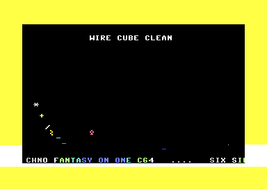
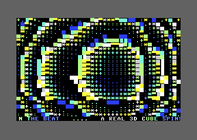
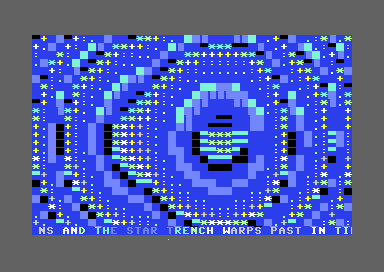
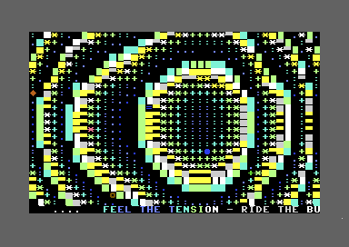

# C64 U83R RUL3Z: New Effects

[](https://github.com/djayuffe/c64-u83r-rul3z-new-effects/actions/workflows/ci.yml)

An ACME-built Commodore 64 megademo with four music-reactive text-mode scenes,
raster-timed presentation, title-card transitions, and a persistent bottom-row
scroller. The release PRG starts from a BASIC `SYS 2061` stub and runs on a
standard PAL C64 configuration.

## Gallery

These are direct captures of the locally built `build/megademo.prg` running in
VICE 3.9. They are runtime frames, not mockups.

| Effect | Runtime capture | What it does |
| --- | --- | --- |
| Wire Cube Clean |  | Sparse mirrored wire accents pulse across the active field. |
| Infinity Corridor |  | Distance and column-warp tables create a colour-cycling tunnel. |
| Gold Trench |  | Perspective rails, a vanishing line, and beat-synced crossbars form the trench. |
| Cube V3 Rotor |  | A connected front/rear wire cube rotates through stable, table-driven geometry. |

## Features

- Four active scenes only: Wire Cube Clean, Infinity Corridor, Gold Trench,
  and Cube V3 Rotor.
- A shared SID-driven `sndPulse` signal modulates every effect.
- Raster IRQ presentation with transitions and an always-available row-24
  scroller.
- A real Cube V3 wireframe: front and rear squares, corner joints, and four
  independent X/Y depth-vector connectors.
- A pre-assembly static audit that protects dispatch integrity, branch targets,
  bundled provenance, and the scroller row.

## Build and run

Requirements: [ACME](https://sourceforge.net/projects/acme-crossass/) and an
emulator such as [VICE](https://vice-emu.sourceforge.io/).

```bash
make
x64sc -autostartprgmode 1 -autostart build/megademo.prg
```

`./build.sh` is a portable wrapper for `make`. The sole generated program is
`build/megademo.prg`; no duplicate root-level PRG is created.

For the complete local verification, including the committed release hashes:

```bash
make verify
```

## Controls

- `Space`: pause/resume the bottom scroller.
- `+`: increase scroller speed (maximum six pixels per frame).
- `-`: decrease scroller speed (minimum one pixel per frame).

## Runtime design

`InitTbl` and `UpdateTbl` are the authoritative lifecycle tables and contain
exactly four targets: `nw`, `ic`, `gt`, and `cv`. Scene renderers own rows 4–22;
row 24 remains exclusively owned by `GlobalScroller`. `NewFxPulsePolish` uses
only named safe rows and is intentionally disabled for Cube V3, whose renderer
clears and redraws its entire field each frame.

See [docs/DEVELOPMENT.md](docs/DEVELOPMENT.md) for the code map and
[docs/AUDIT.md](docs/AUDIT.md) for the checks behind the release.

## Provenance and licensing

`source_material/` preserves the supplied reference files that informed the
four adaptations. They are not assembled directly and may carry their own
provenance or licensing; this repository does not assert a new license over
them. The integration source, build tooling, documentation, and project-owned
assets are Copyright © 2026 Ulf Bertilsson and licensed under
[GPL-3.0-or-later](LICENSE). Details are in [NOTICE](NOTICE).
