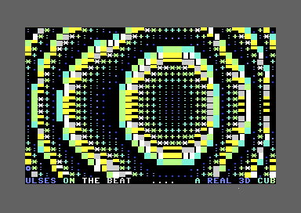

# C64 U83R RUL3Z — New Effects

A Commodore 64 text-mode demo built with ACME. Its active sequence contains four
effects adapted from the bundled source material, a shared raster-driven SID
engine, title cards, and a protected bottom-row scroller.

## Active effects

0. WIRE CUBE CLEAN
1. INFINITY CORRIDOR
2. GOLD TRENCH
3. CUBE V3 ROTOR FINAL

## Effect runtime

`NUM_PARTS` is four. `InitTbl` and `UpdateTbl` are the authoritative dispatch
tables; older effects are not reachable from them. Each effect owns rendering
rows 4–22, while row 24 is exclusively reserved for `GlobalScroller`.

```asm
InitTbl:
        !word nw_init, ic_init, gt_init, cv_init
UpdateTbl:
        !word nw_update, ic_update, gt_update, cv_update
```

## Source material bundled

The original uploaded sources are included under `source_material/` for traceability:

- `deepseek_asm_20251022_1659c4.txt`
- `cube_v3_0_FULLY_FIXED.asm`
- `InfinityCorridor_lowres_v3f_pureraster.zip`
- `goldtrensh_v1_2_clean.zip`

## Build

```bash
./build.sh
x64sc -autostartprgmode 1 -autostart build/megademo.prg
```

Run the commands from the repository root. `build.sh` first runs
`tools/static_audit.py`, then creates `build/megademo.prg` and a convenience
copy at `megademo.prg`. ACME and VICE (`x64sc`) must be installed separately.

## Controls

- `Space`: pause or resume the bottom scroller.
- `+`: increase scroller speed, up to six pixels per frame.
- `-`: decrease scroller speed, down to one pixel per frame.

## Code map

- `src/megademo.s`: BASIC loader, VIC setup, raster IRQ, SID engine, effect
  renderers, transitions, and scroller.
- `InitTbl` / `UpdateTbl`: four-effect lifecycle dispatch.
- `NewFxPulsePolish`: beat-driven accents using rows that cannot touch the
  scroller.
- `tools/static_audit.py`: validates dispatch, source assets, row-24 safety,
  branch targets, and regression markers before assembly.
- `source_material/`: original reference material retained for provenance;
  these files are not assembled directly.

## Verification

```bash
python3 tools/static_audit.py
./build.sh
```

The audit checks structural invariants; assembly confirms ACME syntax and
symbol resolution. The generated PRG has a BASIC `SYS 2061` loader.


## Rendering and music

The final pass binds each new effect to a matching SID style and makes all four active renderers directly react to `sndPulse`.  A tiny shared `NewFxPulsePolish` overlay adds beat-driven accent cells on rows 4..22 only, leaving row 24 exclusively for the scroller.

`NewFxPulsePolish` adds sound-reactive accents after the active renderer. It
uses only rows 4, 6, 8, 10, 13, 16, 19, and 22; the global scroller keeps sole
ownership of row 24. The Cube V3 finale builds a connected wireframe (front
and rear squares plus depth connectors), with independent X/Y depth-offset
tables to avoid diagonal overshoot.

## Source material

The original supplied references are kept under `source_material/` for
traceability. They use their own standalone video models; this project adapts
their visual ideas to its shared C64 text-mode framework.

## Live VICE capture

Final completion closes the Cube V3 diagonal connector bug: connector lines now use depth-vector offset tables (`CvDiagXOffset` / `CvDiagYOffset`) instead of using the same step for X and Y. This prevents shallow 3D depth vectors from overshooting vertically.



This is a native VICE capture of the byte-identical `megademo.prg` produced by the sibling `c64-u83r-rul3z-new-effects` build; the source and generated PRG SHA-256 values match exactly.
